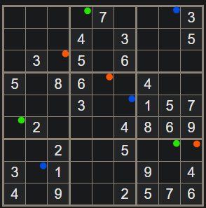


<table>
  
  
</table>

### Letter from Chaplain Mayua

Inside you find a partially completed design for a tattoo of a road and river heading into a sunrise, that could go on the palm or back of a hand.

A simple quipu with three strands, one orange, one green, and one blue, with the following knotted numbers on it:

| Orange | Green | Blue |
|--------|-------|------|
|    7   |   2   |   1  |
|    9   |   1   |   8  |
|    1   |   8   |   5  |

A sudoku to do to "complete" the tattoo design

